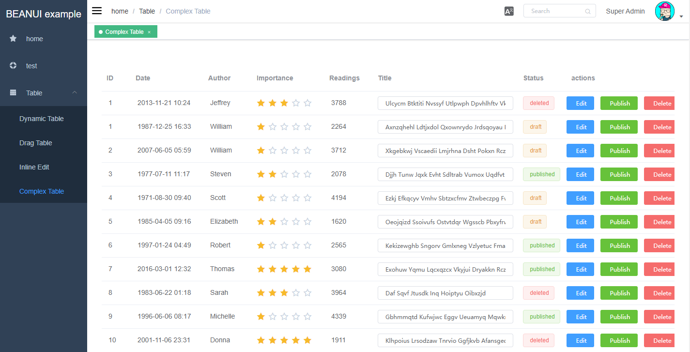

# Angry BeanUI
> 一个依靠纯Java代码来进行开发的UI框架

以下一些场景是否会出现在您的工作当中：
- 我是一名Java开发人员，并不精通Web技术，但今天被安排开发一个简单的页面；
- 一个为期两个月的Java后台服务（后台为主）项目，由于团队无人精通前端，故花费了一个月做页面；
- 前年做了一个图书管理系统，去年做了一个采购管理系统，今年做了一个用户管理系统；
- 我是一个名Java开发人员，实在没有兴趣参与Web开发；

## 目前究竟流行什么Web UI框架？
以上提到的是我经常遇到的困惑，在如今前后端分离的大潮当中，Java也几乎放弃了Web UI框架的投入，就算身为Java开发人员，我们也很少使用Struts、JSF等Java UI框架来开发，JSP也很少写了。
但在一个Javaer的日常中，就算一百个不愿意，还是会遇到UI的需求，但打开搜索引擎时，满满的都是层出不穷的新技术。也许就连身在其中的人也很难说清楚什么是目前流行的Web框架。

## 前后端分离
说到前后端分离，这也是我常常思考的场景，如果简单把我们开发的具备UI的系统分为两类：
- 外部系统（如门户网站、博客等）
- 内部系统（如管理系统等）

那么外部系统往往都有专业的UI工作人员甚至是UI团队来负责，而内部系统则不一定了，那么这时候前端开发的任务便落到了后端工程师的身上。

这种情况下，前后端分离就变得不那么美了，这意味着：
- 学习前端各种框架（Jquery、ReactJS、VUE、Angular）
- 学习前端的测试手段（unit、mock）
- 学习前端编译、打包
- 其实还有很多的理论还有概念需要了解
- 总之前端的知识量绝对不亚于后端，甚至超过后端学习的难度

最后在你恶补知识后花了大力气做出了前端页面，可能依然被喷。

## Javaer理想中的内部UI开发过程
- 不需要了解前端的各种知识
- 在开发完后端代码（如Restful service）后仅需要简单配置即可将页面呈现

我们的内部系统往往不需要绚丽的效果、复杂的动画、高度订制的结构，他可能仅仅是后台服务的一个入口，或者管理一些配置，又或者是管理一些简单的数据对象（如用户、订单、商品之类的），也可能是呈现一些常见的二维报表。他们最多的操作仅仅是对数据对象的CRUD。
故此，我想到了是否能够通过Java反向生成前端代码，在此之前已经有GWT等框架这么做过了，但代码入侵性过强。

## 关于BeanUI的特点
- 纯配置式
- 无侵入式代码
- 快速开发
- 具备一定程度的UI订制能力

## Dependencies
1. install [nodejs](https://nodejs.org) or [npm](https://www.npmjs.com/);
2. install [apache maven](http://maven.apache.org);

## 安装BeanUI
1. `git clone https://github.com/magic-bunny/beanui`
2. `cd beanui`
3. `mvn install`

## 安装和运行BeanUI example
1. `cd beanui/demo/vue`;
2. `npm install`;
3. `cd beanui/demo`
4. `mvn install`
5. `java -jar demo-[version].jar`

## Maven Plugin Parameters
- **routerPath**  menu config file(yaml) path
- **workPath**  html template file path, now based on element ui
- **staticPath**  dist to Java WEB-INF/static
- **projectName**  web project title

## License
GPPT is licensed under the MIT license. See LICENSE for further details.